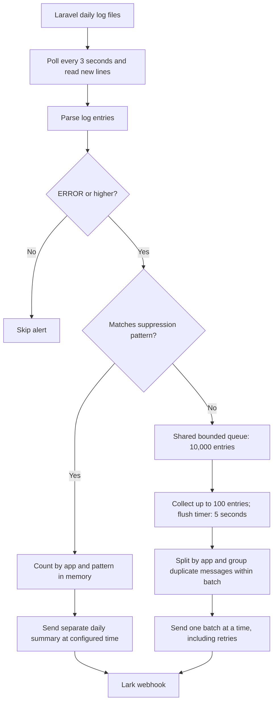
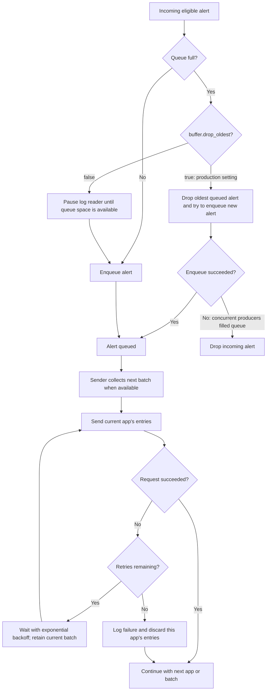

# Laravel Log Collector

Lightweight daemon that tails Laravel log files and sends grouped alerts to a Lark webhook. It polls `storage/logs/laravel-YYYY-MM-DD.log`, parses entries, batches them, and posts a Lark card per app.

## Why use this?
- **Error deduplication** — Repeated errors are grouped and counted rather than sent individually, making it easy to trace issues during high-frequency error bursts.
- **Configurable alert intervals** — Instead of flooding Lark or Telegram with every error in real time, alerts are batched at a configurable polling interval to keep messaging channels clean and readable.
- **Noise suppression** — Define patterns for low-priority errors to suppress them from immediate alerts and receive a single daily summary instead.
- **Bounded alert backlog** — Entries stay in a bounded in-memory queue, with one additional batch being sent at a time. Duplicate messages are grouped within each batch.
- **Zero infrastructure overhead** — Runs as a standalone lightweight service alongside your application, eliminating the need for additional queue workers. Think of it as a mini Fluentbit for Laravel logs.

## What it does
- Watches one or many Laravel `storage/logs` directories.
- Parses standard Laravel log lines (`[YYYY-MM-DD HH:MM:SS] env.LEVEL: message`).
- Filters by minimum log level.
- Buffers and batches entries, then sends to Lark via webhook.
- Retries failed sends with exponential backoff.

## Collection and delivery flow

The values below are the production Taskfile settings. Each app has its own log watcher; all watchers share one bounded queue and one batch sender.



Full batches become ready immediately. Webhook requests are spaced by `lark.min_send_interval` (default 3 seconds), shared across apps, retries, and daily summaries. The flush timer is not a rate limit or a delivery deadline: while a batch is being sent or retried, the sender stops draining the queue. Daily summaries run separately from this batch pipeline.

## Overload and failure flow



The alert pipeline retains up to 10,000 queued entries plus one batch of up to 100 entries with these settings. This bounds entry counts, not bytes; message sizes still affect memory usage. Dropping an alert does not delete the original Laravel log. There is no durable delivery queue, so queued or in-flight alerts can be lost on a crash or restart. Saved file offsets track reading, not successful delivery.

## Quick start
1) Copy and edit the config file:
```sh
cp config.yaml.example config.yaml
```
2) Set your Lark webhook URL in `config.yaml` (or via env vars).
3) Run:
```sh
go run . -config config.yaml
```
Or build a binary:
```sh
go build -o lara_log_collector .
./lara_log_collector -config config.yaml
```

## Configuration
All settings are in `config.yaml`. See `config.yaml.example` for defaults.

Key fields:
- `apps`: list of `{name, log_directory}` entries.
  - If `name` is empty, it is derived from the directory (e.g. `/home/forge/APP/storage/logs` -> `APP`).
- `min_log_level`: minimum level to send (DEBUG, INFO, NOTICE, WARNING, ERROR, CRITICAL, ALERT, EMERGENCY).
- `include_stacktrace`: include the Laravel `[stacktrace]` section in alerts (default `false`).
- `lark`: webhook URL, batch size, flush interval, retry config.
  - `min_send_interval`: minimum spacing between webhook requests (default `3s`; `0s` disables pacing), shared across batches, apps, retries, and summaries.
  - HTTP 200 responses containing nonzero Lark error codes are treated as failed sends.
- `buffer`: in-memory queue size and drop policy.
- `watcher`: polling interval for new log lines (default 3 seconds).
  - `state_filename`: optional state file path; empty = store in `/tmp` with a per-log-dir hash.
- `suppress`: suppress unimportant errors and send a daily summary.
  - `patterns`: list of patterns to suppress.
  - `match`: `substring` (fast) or `regex` (flexible).
  - `case_insensitive`: true/false.
  - `daily_report_time`: report time in `HH:MM`.
  - `timezone`: IANA timezone name (e.g., `Asia/Bangkok`).

Environment overrides:
- `LARK_WEBHOOK_URL`
- `MIN_LOG_LEVEL`

Suppression example:
```yaml
suppress:
  patterns:
    - "Token signature mismatch"
    - "some more error"
  match: "substring"      # "substring" (fast) or "regex" (flexible)
  case_insensitive: true
  daily_report_time: "17:00"
  timezone: "Asia/Bangkok"
```

Regex matching example:
```yaml
suppress:
  patterns:
    - "token signature (mismatch|invalid)"
    - "^JWT .* expired$"
  match: "regex"
  case_insensitive: true
  daily_report_time: "17:00"
  timezone: "Asia/Bangkok"
```

## Daily summary behavior
When `suppress` is configured, matching log lines are **not** sent immediately.
Instead, the collector counts the suppressed occurrences and sends a single
daily summary to Lark at `daily_report_time` in the configured `timezone`.
The summary includes the total count per pattern (and app) observed during the
day. If no suppressed errors occurred, no summary is sent.

## Notes
- Logs are polled (not filesystem events), so very short-lived files could be missed.
- Laravel `[stacktrace]` sections are omitted by default. Set `include_stacktrace: true` to include them.
- When `buffer.drop_oldest` is true and the buffer is full, the oldest entry is dropped to accept new entries.
- The sender processes one batch at a time, including retries. While Lark is slow, entries accumulate in the bounded buffer instead of spawning background sends. At most `buffer.size` queued entries plus `lark.batch_size` batch entries are retained by this pipeline; this is an entry-count limit, not a byte limit. Daily summaries are sent separately.
- Use `buffer.drop_oldest: true` for best-effort alerts under heavy load. With `false`, a full buffer pauses the collector's log reader until space is available. Alerts are not persisted for delivery, and failed batches are discarded after retries. The flush interval is a timer trigger, not a delivery deadline when sending is slow.
- The watcher saves its last read offset per log directory to avoid re-sending entries after restarts.

## Running as a systemd service
This repo includes a sample unit file in `systemd.ini`. Copy it and adjust paths/user:
```sh
sudo cp systemd.ini /etc/systemd/system/lara_log_collector.service
sudo edit /etc/systemd/system/lara_log_collector.service
```

Common commands:
```sh
sudo systemctl daemon-reload
sudo systemctl enable --now lara_log_collector
sudo systemctl status lara_log_collector
sudo systemctl restart lara_log_collector
sudo systemctl stop lara_log_collector
```

Read logs:
```sh
journalctl -u lara_log_collector -f
```

After changing `config.yaml` or the unit file, run:
```sh
sudo systemctl daemon-reload
sudo systemctl restart lara_log_collector
```

## Troubleshooting
- If nothing is sent, verify the log path and that the current file is named `laravel-YYYY-MM-DD.log`.
- If the webhook is required but missing, the app exits with an error.

## Acknowledgements
This project was largely written with the help of [OpenAI Codex](https://openai.com/codex) and [Claude Code](https://claude.ai/claude-code).
